# Lab8web

Membuat Database : Studi Kasus Data Barang

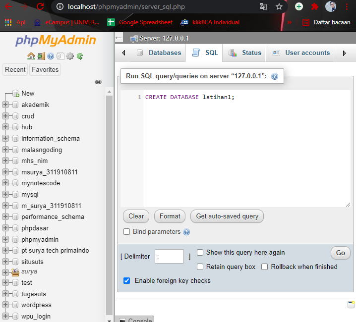

Membuat Tabel data barang

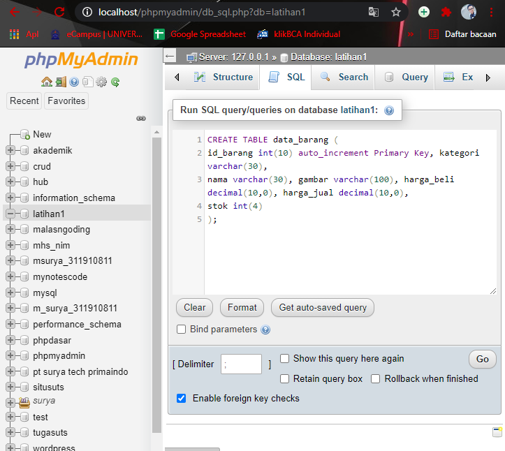

Menambahkan Data pada data barang

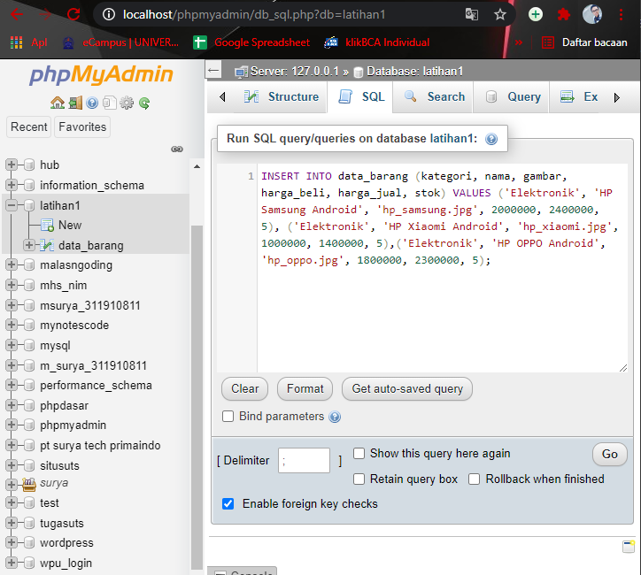
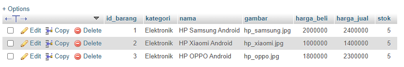

Membuat file koneksi database
Buat file baru dengan nama koneksi.php

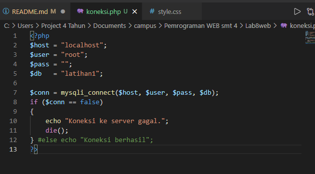
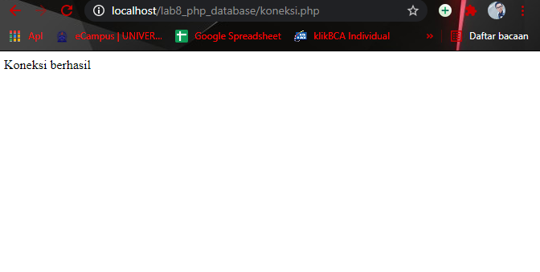

Membuat file index untuk menampilkan data (Read)
Buat file baru dengan nama index.php

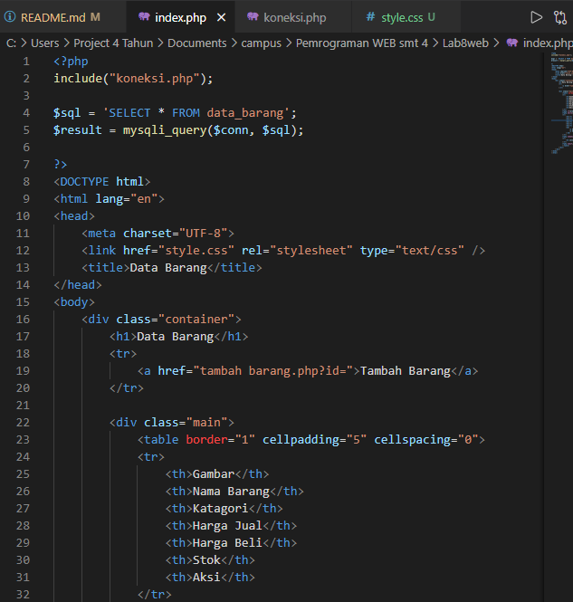
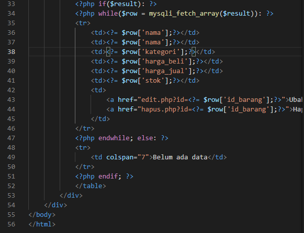
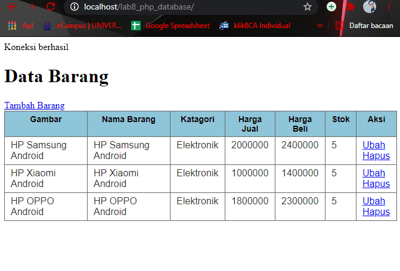

Menambah Data (Create)
Buat file baru dengan nama tambah.php

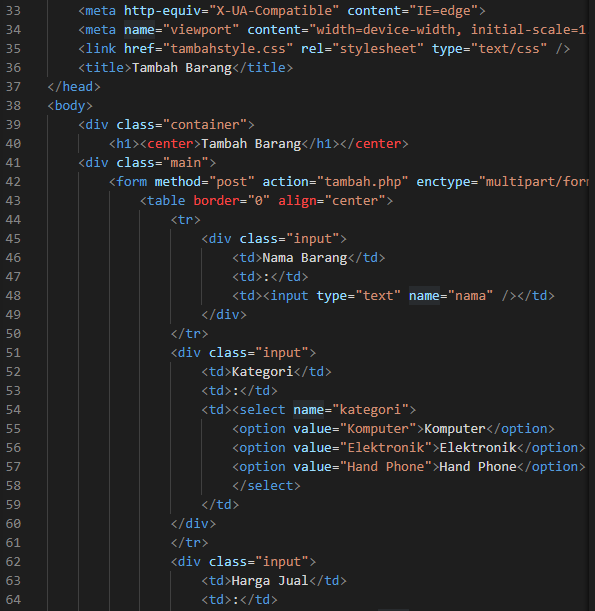
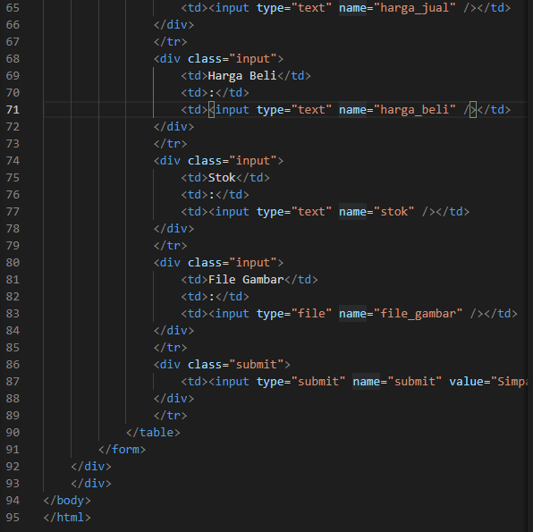
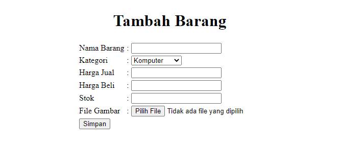

Mengubah Data (Update)
Buat file baru dengan nama ubah.php

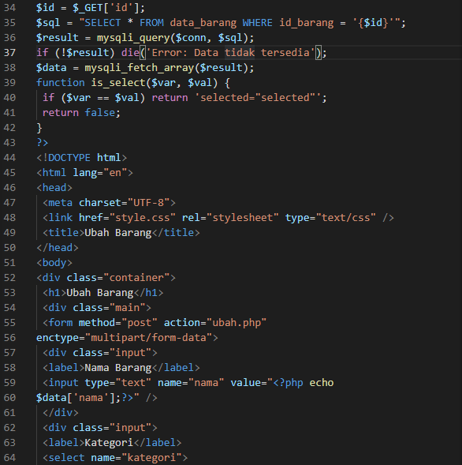
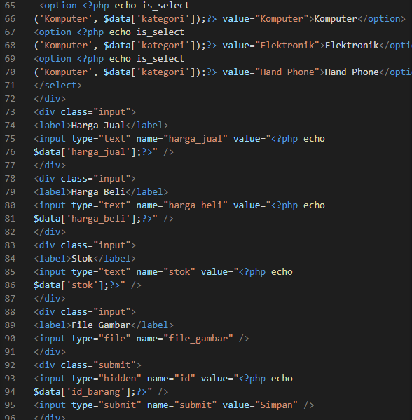
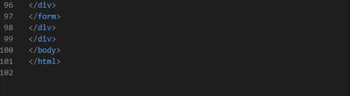
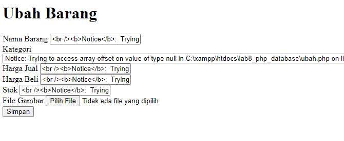

Menghapus Data (Delete)
Buat file baru dengan nama hapus.php

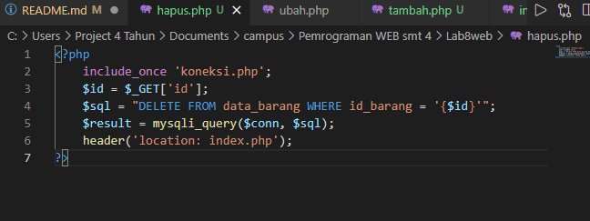

Sebelum dihapus

sesudah dihapus

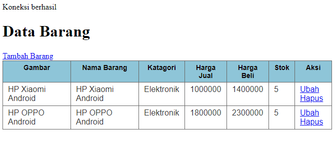
